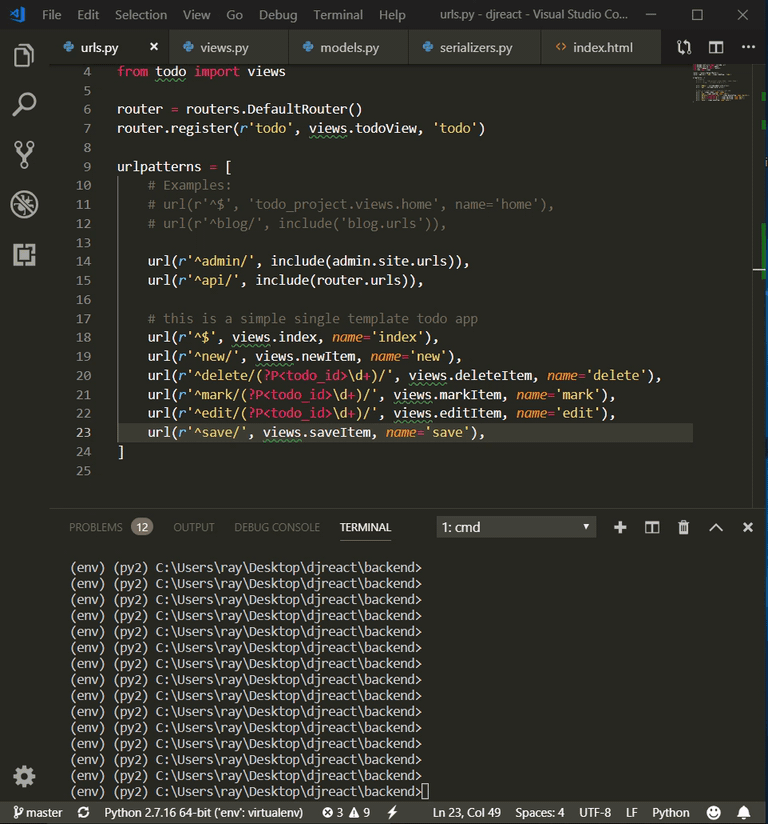
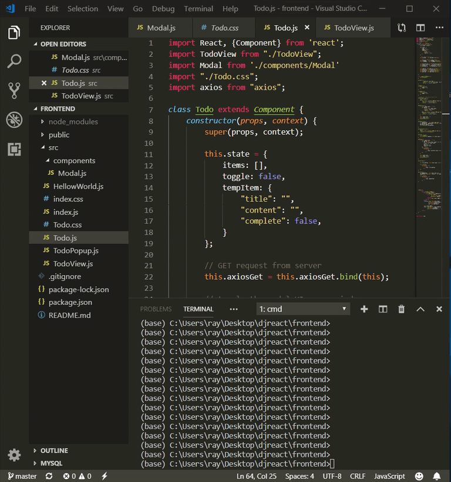
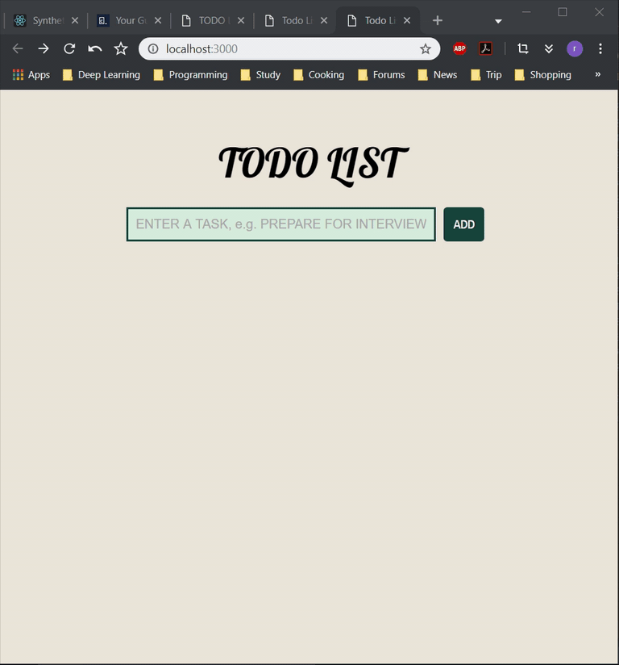
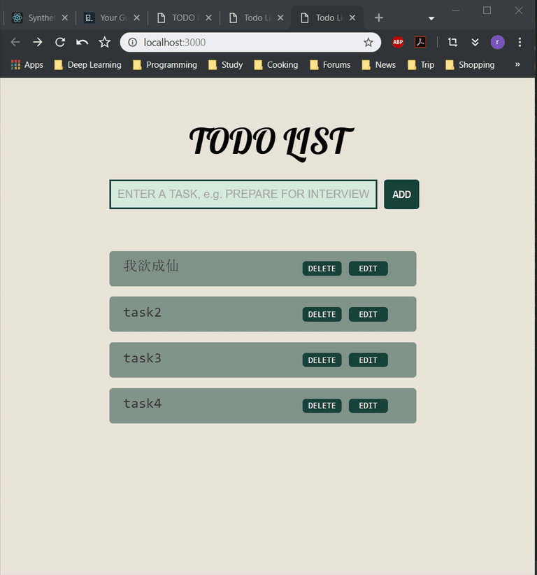
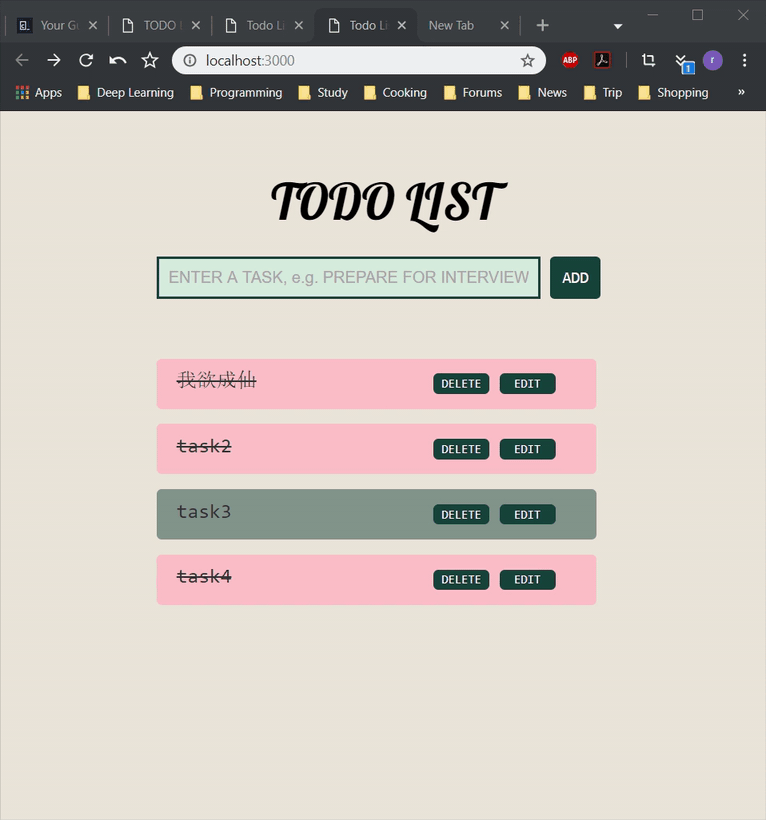
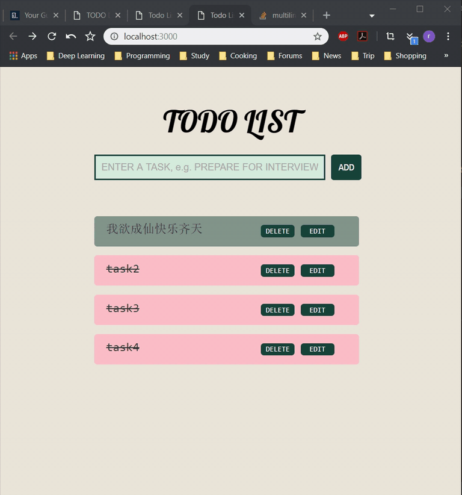

# TODO LIST APP built with React & Djanogo Rest Framework
## Requirements
* Python 2.7.16
* Django 1.8.0
* Django Rest Framework 3.6.4
* Django Filter 1.0.4
* Django CORS Headers 2.4.1

## Installation
1. Make Sure you have python 2 and virtualenv installed, change directory to root of this project, activate the environment for this project
*   in Windows
```
.\env\script\activate
```
* other Platforms
```
./env/script/activate
```

2. go to `backend` folder, and then run
```
python manage.py runserver
```
- and the backend server would run default at [localhost:8000](localhost:8000)



3. go to `frontend` folder, and run
```
npm start
```
- you will see the todo list app automatically opened in your browser at [localhost:3000](localhost:3000)


## Fetures
---
* add TODO Entries



* mark exsiting entries as completed



* edit exsiting todo entries including unmarked completed



* delete exsiting entries



